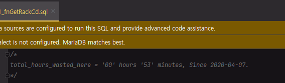
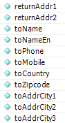

### Clean Code

<details> 
<summary>일단 제일 좋아하는 문구</summary>
<div markdown="1">
When I wrote this code, only God & I understood what it did.
Now... Only God Knows.

Dear maintainer:
Once you are done trying to 'optimize' this routine,<br>
and have realized what a terrible mistake that was,<br>
please increment the following counter as a warning<br>
to the next guy:

total_hours_wasted_here = '0'


</div>
</details>


<details> 
<summary>Class 와 Method 작명</summary>

### <span style="color: yellow">Class, Object</span> 이름은 <span style="color: red">명사</span><br>

[Good] Customer, WikiPage, Account, AddressParser<br>
[Bad] Processor, Data, Info

### <span style="color: yellow">Method, Function</span> 이름은 <span style="color: red">동사</span><br>

[Good] save, createSoemthing, deletePage<br>

### 의미있는 맥락 추가를 통해서 가독성을 높이자.

street, city, state 보다는  
addrStreet, addrCity, addrState



### 길이는 상관 없음

작고 짧은 좋은 이름을 가질 수 있다면 좋지만, 현실은 녹록치 않다...  
길이진다고 해도 짧고 무슨 역활을 하는지 모르는 함수의 이름 보다는 이름이 길어도 명확한 것이 더 좋다.

#### 예시 1

```python
def build_dockerfile(docker_json: DockerJson):
    # get dockerfile info
    image = DockerImage.objects.publish(docker_json)
    dockerfile_info = crate_dockerfile_info(image)

    # build dockerfile
    # if is build in the past, do not build again
    client = MyDockerClient()
    is_built = client.is_exist_docker_image_by_name(image.image_fullname)

    if not is_built:
        # try build
        built_image, built_result = client.build_dockerfile(dockerfile_info)
        # print('id:', built_image.id, 'tags:', built_image.tags, 'labels:', built_image.labels)

        # Check success or fail, then update.
        is_built = client.is_exist_docker_image_by_name(image.image_fullname)
        if is_built:
            DockerImage.objects.update_build_image_result_success(image.id, built_result)
        else:
            DockerImage.objects.update_build_image_result_failed(image.id, built_result)
            logging.error(f"{dockerfile_info} build failed")
    else:
        logging.info(f"{dockerfile_info} is already built")
```

### 이름 정할 때
Class 나 Method 이름을 정할때 한번에 떠올리지 않거나 이름이 너무 길어지면
Class나 Method 가 맡은 책임이 많지 않은가 생각을 해야 한다.


### 단일 책임 원칙
```python
class File(object):

    def create_file(self):
        pass

    def read_file(self):
        pass

    def parse_file(self):
        pass

class FileCreator(object):
    
    def create_file(self):
        pass

class FileReader(object):

    def read_file(self):
        pass

class FileParser(object):

    def parse_file(self):
        pass
```

### 응집도, 의존성 등 있는데 
이건 복잡 하고 실제로 해보지 않으면 잘 안와 닿음  
따로 리팩토링도 하고 수정도 하면서 익숙해져야 함

</details>


<details> 
<summary>Method 작성</summary>

### 함수는 작게 만들고 한가지 역할만 해야 한다.

이를 통해서 1~2단 수준의 들여쓰기 뎁스 유지를 할 수 있고  
함수는 읽기 쉬워지고 이해하기 쉬워집니다.

#### 예시 1

들여쓰기 수준 유지

```python
def 전_something_method():
    if is_somthings_true:
        if is_anythings_true:
            for i in range(100):
                print(i)


def 후_something_method():
    if is_somthings_true and is_anythings_true:
        addon_method()


def addon_method():
    for i in range(100):
        print(i)
```

#### 예시 2

WMS 에서 gitlab 체크 health 체크 용 클래스 중 한가지 역할만

```python
# 전
def check(self):
    result = []
    response = req_gitlab('{}{}'.format(self.gitlab_live_url, self.token))
    if response.get('status') != 'ok' and do_send_discord:
        send_to_discord(self.discord_hook_url, 'GitLab(Liveness) might dead, you should Check!')
    result.append(response.get('status'))

    response = req_gitlab('{}{}'.format(self.gitlab_read_url, self.token))
    if response.get('status') != 'ok' and do_send_discord:
        send_to_discord(self.discord_hook_url, 'GitLab(readiness) might dead, you should Check!')
    result.append(response.get('status'))

    return result


# 후
def check_live(self, do_send_discord = False) -> str:
    response = req_gitlab('{}{}'.format(self.gitlab_live_url, self.token))
    if response.get('status') != 'ok' and do_send_discord:
        send_to_discord(self.discord_hook_url, 'GitLab(Liveness) might dead, you should Check!')

    return response.get('status')


def check_read(self, do_send_discord = False) -> str:
    response = req_gitlab('{}{}'.format(self.gitlab_read_url, self.token))
    if response.get('status') != 'ok' and do_send_discord:
        send_to_discord(self.discord_hook_url, 'GitLab(readiness) might dead, you should Check!')

    return response.get('status')
```

유저 암호 체크 함수인데 안에서 session initialize 를 한다.   
이렇게 될경우 함수 이름에 의미를 추가해주거나 함수를 2가지로 쪼개는 방법이 있다.
```python
def change_password(username: str, password: str) -> bool:
    try:
        user = User.object.get(username)
        user.encrypt_password(password)
        session_initialize()

    except User.DoseNotExist:
        raise UserDoesNotExist("user is not exist")

# 함수 이름만 추가하던가
def change_password_and_sess_init()
    ...

# 두개 만들던가
def change_password_and_sess_init()
    ...

def change_password():
    ...
```

</details>

<details> 
<summary>Method Parameter</summary>
이상적인 파라미터의 개수는 <span style="color: yellow">0개</span> 이다<br>
다음은 <span style="color: yellow">1개</span><br>
다음은 <span style="color: yellow">2개</span><br>
<span style="color: orange">3개</span> 는 슬슬 피하는게 좋다<br>
<span style="color: red">4개 이상</span>은 작성을 왠만하면 피하자<br>

많은 파라미터는 Test Logic 작성을 어렵게 만들면서 또한 로직의 가독성을 떨어트리고 이해하기 어렵게 만든다.

### <span style="color:yellow">1개</span>

Parameter 로 결과를 Return 하는 경우

```python
def is_exist_file(filepath: str) -> bool:
    if os.path.exists(filepath):
        return True
    return False


def get_dir_filenames(dirpath: str) -> Generator:
    """
    :param dirpath: directory 경로
    :return: 파일 이름들
    :rtype: Generator[str]
    """
    return (f for f in os.listdir(dirpath) if os.path.isfile(os.path.join(dirpath, f)))
```

Boolean Parameter 는 함수가 이미 두가지 역할을 의미하므로 다시 코드 작성해라. 아래같은 경우는 좀 사람마다 좀 갈림

```python
#
def update_build_image_result(image_id: int, result: str, is_success: bool):
    rows = self.filter(id = image_id).update(
        build_image_result = result, build_image_success = is_success
    )
    return rows


#
def update_build_image_result_success(self, image_id: int, result: str) -> int:
    rows = self.filter(id = image_id).update(
        build_image_result = result, build_image_success = True
    )
    return rows


def update_build_image_result_failed(self, image_id: int, result: str) -> int:
    rows = self.filter(id = image_id).update(
        build_image_result = result, build_image_success = False
    )
    return rows
```

### <span style="color:red">2개 이상</span>

2개 이상 부터는 줄일 수 있는 경우는 줄이자

```python
def build_dockerfile(image_name: str, image_tag: str, local_port: list):
    ...


DockerJson = namedtuple(
    'Dockers_json',
    ['image_name', 'image_tag', 'local_port']
)


def build_dockerfile(docker_json: DockerJson):
    # get dockerfile info
    image = DockerImage.objects.publish(docker_json)
    dockerfile_info = crate_dockerfile_info(image)
    ...

# value validator object 만들어서 해도 되고
# 간단한거면 namedtuple 이나 map 으로 해도 되고
class DockerJson(object):

    def __init__(self, image_name, image_tag, local_port):
        self.image_name = image_name

    @property
    def clean_image_name(self):
        if self.image_name in ['PHp']:
            self.image_name = "PHP"
        return self.image_name

```

</details>


<details>
<summary>Code 작성</summary>
아래처럼 짜는게 중요한 이유는 아래 예시처럼 한군데서 사용하고 간단하면 상관 없지만
실무에서는 저렇게 짤 경우 experienced_year, team_name 가 변경 될 경우
해당 변수가 사용되는 모든 곳을 다 찾아서 사이드 이펙트 없는지 전부 검토 등 해야하기 때문에

한군데서만 검증 하도록 하자

```python
class Member(object):
    name = 'Snow'
    experienced_year = 10
    team_name = "Devops"
    
member = Member()    
 
if member.experienced_year >= 10 and member.team_name in ['Devops', 'Solution']:
    calling_himself_senior_developer()


# 후
class Member(object):
    name = 'Snow'
    experienced_year = 10
    team_name = "Devops"
    
    def is_enough_for_senior_developer(self):
        if member.experienced_year >= 10 and member.team_name in ['Devops', 'Solution']:
            return True
        return False

member = Member()    
 
if member.is_enough_for_senior_developer():
    calling_himself_senior_developer()
```
</details>

<details>
<summary>예외처리</summary>

### 예시1
```python
class DeviceController:

    def shutdown(self):
        try:
            self.try_shutdown()
            
        except (DeviceControllerError, DeviceShutdownError) as e:
            logger.error()

    def try_shutdown(self):
        device = self.get_handle()
        device.pause()
        device.clear_queue()
        device.close()

    def get_handle(self, device_id: int):
        ...
        raise DeviceControllerError('Invalid device handle')
```

### 이런 방법은?
```python
def catch_device_controller_error(catch: tuple):
    def decorator(func: Callable):

        @functools.wraps(func)
        def wrapper(*args, **kwargs):
            try:
                return func(*args, **kwargs)
            except catch as e:
                # TODO 에러처리

        return wrapper

    return decorator


class DeviceController:

    @catch_device_controller_error(catch = (DeviceControllerError, DeviceShutdownError))
    def shutdown(self):
        device = self.get_handle()
        device.pause()
        device.clear_queue()
        device.close()

    def get_handle(self, device_id:int):
        ...
        raise DeviceControllerError('Invalid device handle')
```

### 예시2
```python
# 전
def create_container_and_run(self, image: DockerImage):
    name = image.image_fullname
    try:
        logging.info(f"Docker run image : {name}")

        if image.local_port:
            container = self.client.api.create_container(
                image = name, detach = True, name = name, ports = [image.local_port],
                host_config = self.get_create_host_config(image.local_port)
            )
        else:
            container = self.client.api.create_container(image = name, detach = True, name = name)

    except docker.errors.ImageNotFound as e:
        # If the specified image does not exist.
        logging.error(f"{name} image is not exist")
        raise DockerImageIsNotExist(f"{name} image is not exist")
    except docker.errors.APIError as e:
        # If the server returns an error.
        logging.critical(brief_except())
        raise e

    try:
        self.client.api.start(container.get("Id"))
    except (docker.errors.APIError, docker.errors.DeprecatedMethod) as e:
        # If the server returns an error.
        # If any argument besides ``container`` are provided.
        logging.critical(brief_except())
        raise e

    return True

# 후
def create_container_and_run(self, image: DockerImage):
    name = image.image_fullname
    try:
        logging.info(f"Docker run image : {name}")
        self.create_container(image)

    except docker.errors.ImageNotFound as e:
        # If the specified image does not exist.
        logging.error(f"{name} image is not exist")
        raise DockerImageIsNotExist(f"{name} image is not exist")
    except docker.errors.APIError as e:
        # If the server returns an error.
        logging.critical(brief_except())
        raise e

    try:
        self.client.api.start(container.get("Id"))
    except (docker.errors.APIError, docker.errors.DeprecatedMethod) as e:
        # If the server returns an error.
        # If any argument besides ``container`` are provided.
        logging.critical(brief_except())
        raise e

    return True

def create_container(self, image:DockerImage) -> dict:
    name = image.image_fullname
    if image.local_port:
        container = self.client.api.create_container(
            image = name, detach = True, name = name, ports = [image.local_port],
            host_config = self.get_create_host_config(image.local_port)
        )
    else:
        container = self.client.api.create_container(image = name, detach = True, name = name)
    return container
```
</details>


<details>
<summary>테스트 GWT</summary>

### 예시1
```python
@Test
public void createLog() throws Exception {
    // given
    String email = "test1@kr.accommate.com";
    memberService.join(MemberEntity.builder().name("TestUser").email(email).level(Level.MEMBER).password("test").build());
    MemberEntity findMember = memberService.findByEmail(email);

    MemberLogEntity createMemberLog = MemberLogEntity.builder()
            .logType(LogType.CREATE_USER).member(findMember).logMessage("create user").build();

    // when
    MemberLogEntity memberLog = memberLogService.register(createMemberLog);
    Optional<MemberLogEntity> findMemberLog = memberLogService.findById(memberLog.getId());

    // then
    if (findMemberLog.isPresent()) {
        assertEquals(findMemberLog.get().getLogType(), LogType.CREATE_USER);
        assertEquals(findMemberLog.get().getLogMessage(), "create user");
        assertEquals(findMemberLog.get().getMember().getName(), "TestUser");

    } else {
        fail("fineMemberLog 는 무적권 Empty 아님");
    }
}
```

### 예시2
```python
@pytest.mark.django_db
def test_partner_views_api_is_create_correctly_partner_owner_by_partner_id_ta():
    from apps.module.service.outqueue.push.outqueue_response_taobao import OutQueueResponse_Taobao
    from apps.module.util.exception_outqueue import OutQueuePartnerNotAllowed
    # given
    target, expected = 'tb67', True

    def create(**kwargs):
        partnerId = kwargs['partnerId']
        partner = PartnerModel.objects.using('HQ_SLAVE').get_one(partnerId = target)
        partner_owner = partner.partnerOwner

        if partner_owner == 'TA':
            return OutQueueResponse_Taobao(partnerId)

        else:
            return OutQueuePartnerNotAllowed('partner is not allowed : {}'.format(partnerId))

    # when
    result = create(partnerId = target)
    
    # then
    if isinstance(result, OutQueueResponse_Taobao):
        result = True
    else:
        result = False
    assert result, expected
```

</details>