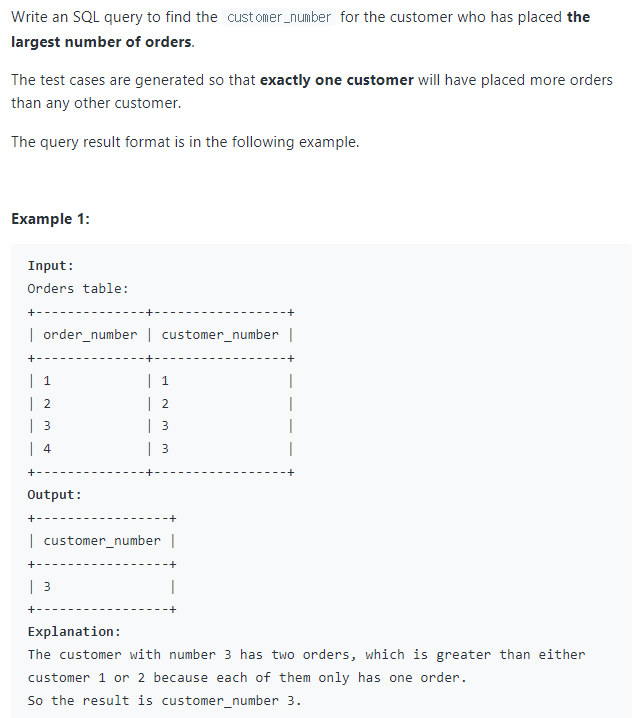
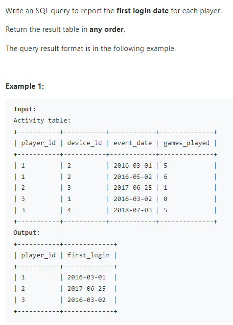
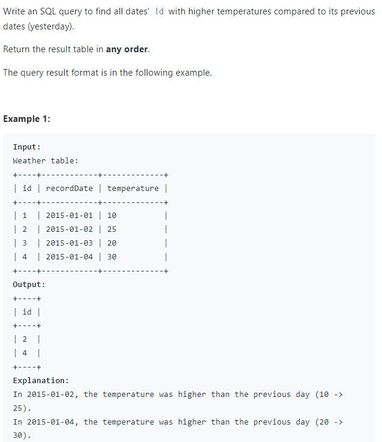
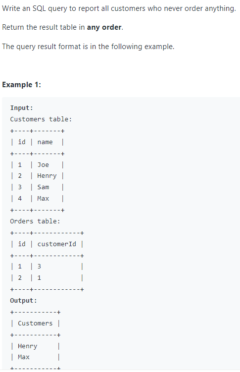
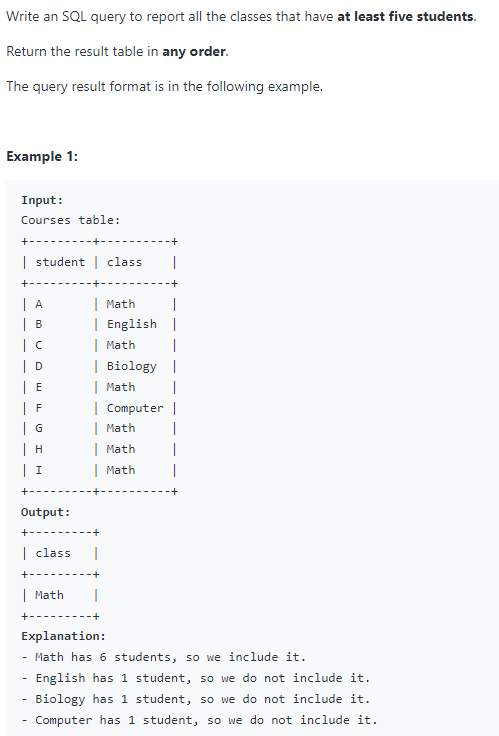
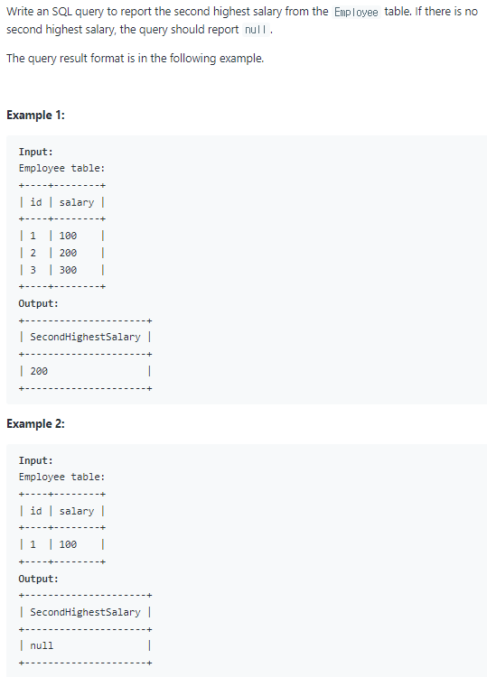
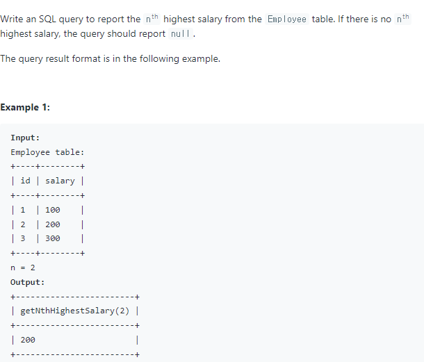
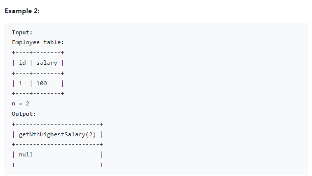

# Query 
쿼리쿼리 👍

<details>
<summary>Row가 많은 FK 찾기</summary>


```sql
SELECT 
    customer_number
FROM 
    Orders
GROUP BY customer_number
ORDER BY COUNT(*) DESC 
LIMIT 1
```
</details>


<details>
<summary>Pk별로 오래된 날짜 가져오기 ✔Min()</summary>


```sql
SELECT 
    player_id, MIN(event_date) AS first_login
FROM
    Activity
GROUP BY player_id
```
</details>


<details>
<summary>하루 전날보다 큰 값을 가진 Row 가져오기 ✔Datediff()</summary>


```sql
SELECT
    id
FROM 
    Weather W1, Weather W2
WHERE 
    DATE_DIFF(W2.recordDate, W1.recordDate) == 1
    AND W2.temperature > W1.temperature 
```
</details>

<details>
<summary>전형적인 ✔Left Outer Join</summary>


```sql
SELECT
    name AS Customers
FROM
    Customers C LEFT JOIN Orders O 
        ON C.id = O.customerId
WHERE O.id = null
```
</details>

<details>
<summary>전형적인 ✔Group By ✔Having Count</summary>


```sql
SELECT 
    class
FROM 
     Courses
GROUP BY class having count(*) >= 5
```
</details>


<details>
<summary>두번째로 높은값 찾기 ✔Distinct ✔Limit</summary>


```sql
SELECT 
   IFNULL(
        (SELECT DISTINCT salary FROM Employee ORDER BY salary desc LIMIT 1, 1)
        , null
   ) as SecondHighestSalary 
```
</details>


<details>
<summary>N번째로 높은값 찾기 ✔MySQL Function ✔Distinct ✔Limit</summary>



```sql
CREATE FUNCTION getNthHighestSalary(N INT) RETURNS INT
BEGIN

DECLARE M INT;
SET M=N-1;

  RETURN (
      # Write your MySQL query statement below.
      SELECT IFNULL(
        (SELECT DISTINCT salary FROM Employee ORDER BY salary DESC LIMIT M, 1)
        , null
      )
  );
END
```
</details>
