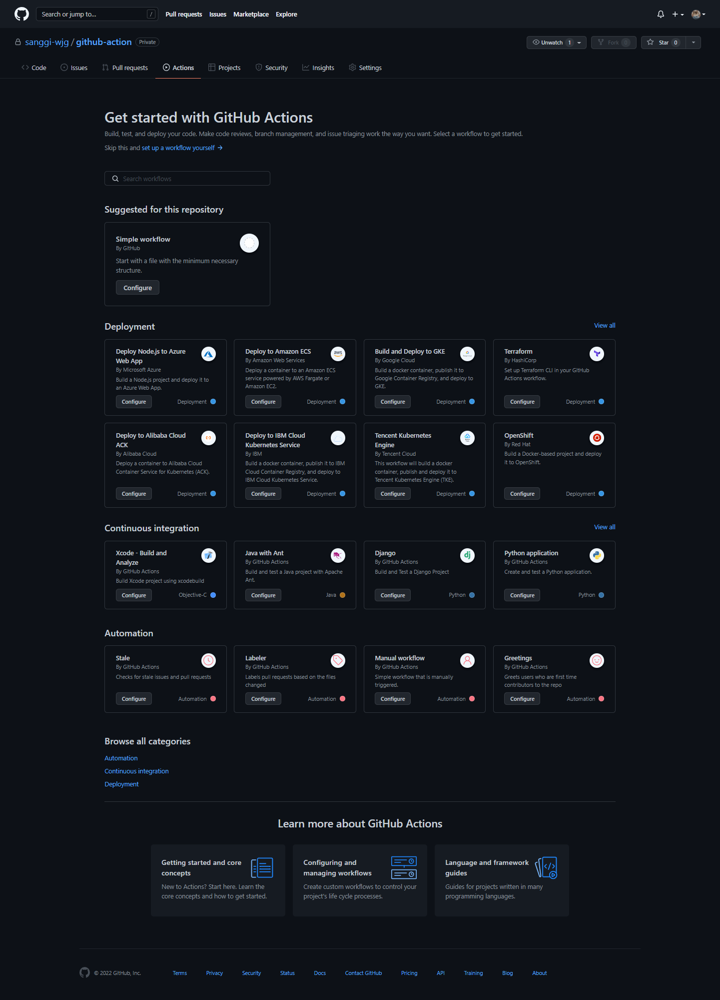

# Github Action

## 개요
Github action 은 github에서 공식적으로 제공하는 work flow 자동화 툴.

github action 안에서 사용하는 개념은 생략

github repo 안에 `.github/workflows` 경로에 yml 파일 작성해서 생성.

### 사용 용도
#### CI/CD
예를 들어,   
CI는 파이썬 경우 flake Python lint 검사 하거나 pytest 등  
자바나 코틀린 경우 compile test, gradle(or maven) build test 등

CD는 Docker image build 나 원격 서버 배포 등등

#### 기타 자동화
그냥 말그대로 기타 용도, 어떻게 쓰냐에 따라 많음  
어떤 자료 취합해서 이메일 보내거나  
예시처럼 스크랩 해서 웹 훅 보내거나 등등등

<hr>

## 방법

### 1. Github private repository 생성

### 2. Action 탭에서 action.yml 생성



### 3. action.yml 작성 
```yaml
name: Send WTI Stock 

on:
   schedule:
     - cron: '00 15 * * *' # default UST 

jobs:
  build:
    runs-on: ubuntu-20.04
    steps:
    - uses: actions/checkout@v2
    - name: Set up Python 3.8
      uses: actions/setup-python@v2
      with:
        python-version: "3.8"
    - name: Install python dependencies
      run: |
        python -m pip install --upgrade pip
        pip install selenium==4.1.0 requests pillow
        if [ -f requirements.txt ]; then pip install -r requirements.txt; fi
    - name: Install ubuntu package
      run: |
        wget https://chromedriver.storage.googleapis.com/84.0.4147.30/chromedriver_linux64.zip
        unzip ./chromedriver_linux64.zip  
    - name: Execute code
      run: |
        python3 ./send_wti_stock.py
```

### 4. 실행할 send_wti_stock.py Python file commit
```python
import requests
from selenium import webdriver
from selenium.webdriver.common.by import By


def send_to_discord(filename):
    discord_webhook_url = "https://discord.com/api/webhooks/936272198639964180/IoA6kaWSxhcbDpSIV-xBZnNHTeZVx1hdTap8q1pGHPP8KHwbAINmXsMunFv5v43D80Zg"
    response = requests.post(
        url = discord_webhook_url,
        headers = { "Content-Disposition": "form-data" },
        files = { 'file': (filename, open(filename, 'rb')) }
    )
    # print(response.status_code)
    # print(response.text)


save_filename = "screenshot.png"

options = webdriver.ChromeOptions()
options.add_argument('--headless')
options.add_argument('--no-sandbox')
options.add_argument('--disable-dev-shm-usage')
options.add_argument('--disable-gpu')
driver = webdriver.Chrome('./chromedriver', options = options)

try:
    driver.implicitly_wait(3)

    driver.get('https://www.google.com/search?q=wti+oil+stock')
    find = driver.find_element(by = By.CLASS_NAME, value = "webanswers-webanswers_table__webanswers-table")
    table = find.find_element(by = By.TAG_NAME, value = "table")

    file = table.screenshot(save_filename)
    send_to_discord(save_filename)

finally:
    driver.quit()

```

<hr>

## 장단점
### 장점
* Github 오픈 소스 만들때 다른 CI/CD 구축한 서버 없이도 CI/CD 로 충분히 활용 가능  
* CI/CD 외에 목적으로도 활용 가능 함.

### 단점
* 테스트 중에 예약 시간에 workflow가 작동을 안해서 구글에서 찾아보았는데 실행 시간이 불규칙 하다고 함.
> The schedule event can be delayed during periods of high loads of GitHub Actions workflow runs. 
> High load times include the start of every hour. To decrease the chance of delay, 
> schedule your workflow to run at a different time of the hour.
* 즉시 실행이 없음
* 다른 CI/CD 오픈 소스에 마켓 쉐어 밀려서 신경 덜 쓰는 느낌? 

#### 참고
https://zzsza.github.io/development/2020/06/06/github-action/