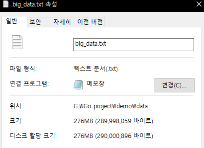

# Go lang으로 대용량 파일 chunk 단위로 나누기

Go lang으로 대용량 파일에 대해서 chunk 단위로 나누어 보자. 나누기 위해서 우선 대용량 파일을 생성한 후 나누기를 진행 할 것이다.
1. 대용량 파일 생성
2. 파일 나누기


## 1. 대용량 파일 생성
```go
package main

import (
	"fmt"
	"math"
	"os"
	"runtime"
	"strconv"
	"time"
)

const MAX_CONCURRENT_JOB = 10
const NUMBER_OF_UNORDERED = 100000000 

const BIG_DATA_ROOT = "data"
const BIG_DATA_FILE_PATH = "data/big_data.txt"

const FILE_CHUNK_SIZE = 10 * (1 << 20) // 10MB = 10 * (1024² = 2²⁰)

func ifNotExistThenMkdir(dir string) {
	if _, err := os.Stat(dir); os.IsNotExist(err) {
		os.Mkdir(dir, 0644)
	}
}

func ifErrorThenPanic(err error) {
	if err != nil {
		panic(err)
	}
}

func createUnorderedFile(number int) {
	// create dir & file
	ifNotExistThenMkdir(BIG_DATA_ROOT)
	file, err := os.Create(BIG_DATA_FILE_PATH)
	ifErrorThenPanic(err)
	defer file.Close()

	// go write
	channel := make(chan bool, MAX_CONCURRENT_JOB)
	for i := 0; i < number; i++ {
		go writeNumber(file, rand.Intn(100), channel)
		<-channel
	}
}

func writeNumber(f *os.File, d int, ch chan bool) {
	// write
	_, err := f.Write([]byte(strconv.Itoa(d) + " "))
	if err != nil {
		ch <- false
	}
	ch <- true
}
```
파일이 생성 되었다.



## 2. 파일 나누기
```go
func splitFileToChunks() {
	// create dir & file
	ifNotExistThenMkdir(SPLIT_DATA_ROOT)

	// open file
	readFile, err := os.Open(BIG_DATA_FILE_PATH)
	ifErrorThenPanic(err)
	defer readFile.Close()

	// get info about file
	readFileInfo, err := readFile.Stat()
	ifErrorThenPanic(err)
	readFileSize := readFileInfo.Size()

	// calculate count will be split
	splitCount := int(math.Ceil(float64(readFileSize) / FILE_CHUNK_SIZE))

	// split
	channel := make(chan bool, splitCount)
	for i := 0; i < int(splitCount); i++ {
		go intoChunk(readFile, readFileSize, i, channel)
		<-channel
	}
}

func intoChunk(readFile *os.File, readFileSize int64, i int, ch chan bool) {
	// default size or rest of file size
	chunkSize := int(math.Min(FILE_CHUNK_SIZE, float64(readFileSize-int64(i*FILE_CHUNK_SIZE))))
	buffer := make([]byte, chunkSize)

	// read
	readFile.Read(buffer)
	splitFileName := SPLIT_DATA_FILE_PATH + strconv.Itoa(i+1) + ".txt"

	// create
	splitFile, err := os.Create(splitFileName)
	if err != nil {
		ch <- false
	}
	defer splitFile.Close()

	// write
	_, err = splitFile.Write(buffer)
	if err != nil {
		ch <- false
	}
	ch <- true
}
```
10MB 단위로 chunk 생성 이후 마지막 파일에서
default size or rest of file size


## Main 함수
```go
func main() {
	runtime.GOMAXPROCS(runtime.NumCPU() / 2)
	start := time.Now()
	// main
	createUnorderedFile(NUMBER_OF_UNORDERED)
	splitFileToChunks()
	fmt.Println("Total Execute Time: " + time.Now().Sub(start).String())
}
```