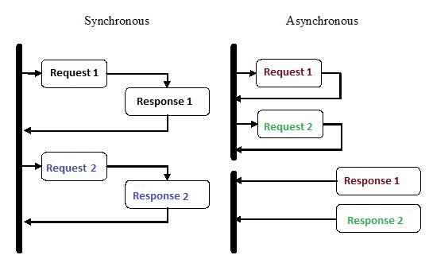
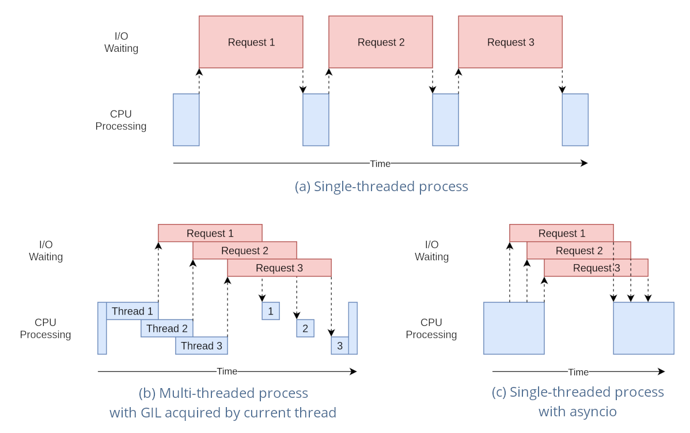
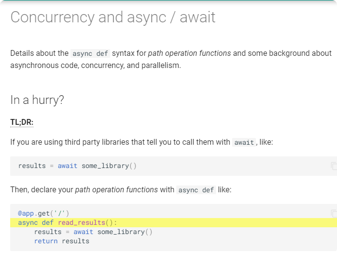
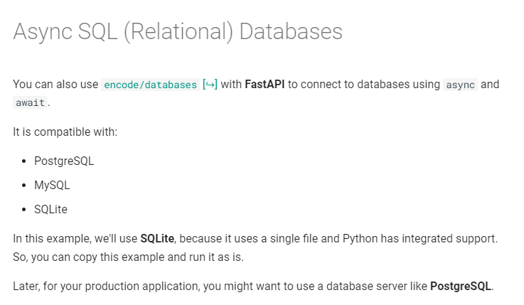

## 비동기 I/O

개발 업무를 하면서 실제 코드 자체보다는 필요한 데이터를 얻어오는 작업이 병목이 생기는 것을
많이 겪었을 것이다. 이런경우 프로그램 ``I/O 위주``라 하고 I/O 효율이 속도를 제한 한다는 것을 의미한다.

I/O는 프로그램 흐름에 큰 영향을 미친다. 파일이나 네트워크 소켓 연결을 통해 데이터를 읽을 때까지
실행을 멈추고 커널에 연산을 요청한 후 끝날때 까지 기다려야 하기 때문이다.

비동기 I/O를 활용하면 I/O 연산을 기다리는 동안 다른 연산을 수행하여 유휴 시간을 활용할 수 있다.
작업1,2,3 을 순차적으로 실행한다면 지연을 세번 감수해야 하지만 세 작업을 동시에 실행한다면 
시간을 감소할 수 있을 것이다.

파이썬에서는 제너레이터 기반의 Coroutine과 ``async 함수``로 ``Native Coroutine``을 사용한다.
async 는 Python 3.6 부터 지원한다.





### Coroutine request sample 
```go
router.GET("/long_sync", func(c *gin.Context) {
    // simulate a long task with time.Sleep(). 5 seconds
    time.Sleep(5 * time.Second)
    c.String(http.StatusOK, "Done!")
})
```

```python
import asyncio
import aiohttp

async def request_long_sync():
    url = "http://localhost:9000/long_sync"
    async with aiohttp.ClientSession() as client:
        async with client.get(url) as res:
            print(await res.read())

async def async_method():
    await asyncio.wait([
        request_long_sync(),
        request_long_sync()
    ])

asyncio.run(async_method())
```

```python
import asyncio
import aiohttp

async def request_long_sync():
    url = "http://localhost:9000/long_sync"
    async with aiohttp.ClientSession() as client:
        async with client.get(url) as res:
            print(await res.read())

async def async_method():
    task1 = asyncio.create_task(request_long_sync())
    task2 = asyncio.create_task(request_long_sync())
    await task1
    await task2

asyncio.run(async_method())
```

## Thread 와 async 의 차이
CPU bound 작업을 할 때에만 GIL로 인해 한번의 한 쓰레드에서만 파이썬 코드를 실행 할 수 있는데 
I/O bound 작업의 경우 Thread와 async 모두 GIL을 해체하여 다른 쓰레드가
이어서 작업을 진행할 수 있도록 여러개의 쓰레드를 사용해 동시 처리가 가능하다.

* `Thread` 객체는 개발자가 직접 생성하지만 `Task` 객체는 직접 생성하지 않고
`ensure_future()`를 통해 생성 된다.
* `Thread` 는 `start()`를 통해 실행 되지만 `Task` 는 `ensure_futer()` 에서 예약 실행 된다.
* `Thread` 객체는 외부에서 쓰레드 내부를 제어할 수 있는 API 가 없고
아무때나 중단 시키면 시스템의 무결성을 해칠수 있다. 반면, `Task` 객체는 
코루틴 안에서 `CancledError` 를 발생 시키는 `Task.cancel()` 이 있다.


### FastAPI Offer Coroutine  
최근 Python Web Framework 가 
Flask or Django 에서 -----> FastAPI 로 넘어가는 추세




## Ref
```
https://nachwon.github.io/asyncio-and-threading/
```
