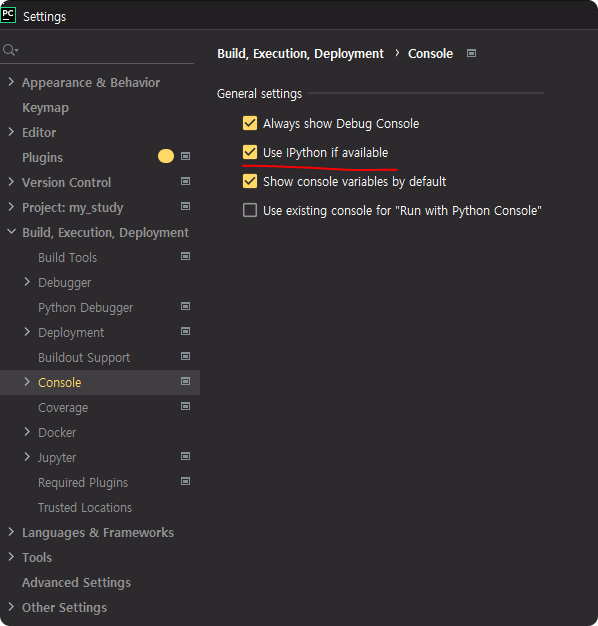

# data struct
많이 사용하는 data struct 는 4개 `list, tuple, set, dictionary` 이 4개 이고  
추가로 `frozenset, namedtuple, dataclass` 등 여러 데이터 저장을 도와 주는 것들이 있지만 자주
사용은 하지 않으니 관심 있으면 따로 확인 추천.

## List
list 는 **동적 배열**로 크기를 자유 자재로 조절할 수 있는데  
이러한 변경 가능한 특성 때문에 list 는 변경 시 `추가 메모리와 추가 연산을 필요`로 한다.

### list 의 작동 방법

list 에 object 추가시 기존 objects 와 추가 되는 objects 를 추가하는 방식으로  
object 추가시 list의 크기는 기존 N개의 object + 추가 되는 1개의 object 를 더하여 N+1이 아니라 
M (M > N+1) 의 메모리 크기를 가진다. 
메모리 크기에 여유를 두는 이유는 커널 단에서 메모리 할당과 복사 요청 횟수를 줄이기 위해서


### list 의 메모리 여유 할당
```python
a = []
print('0', sys.getsizeof(a))
a.append(1)
print('1', sys.getsizeof(a))
a.append(2)
print('2', sys.getsizeof(a))
a.append(3)
print('3', sys.getsizeof(a))
a.append(4)
print('4', sys.getsizeof(a))
a.append(5)
print('5', sys.getsizeof(a))
```
```shell script
0 64
1 96
2 96
3 96
4 96
5 128
```

### list 의 메모리 여유 할당 2
```python
a = []
for i in range(1, 8001):
    a.append(i)
    print(i, sys.getsizeof(a))
```
```
1 96
2 96
3 96
4 96
5 128
6 128
7 128
8 128
9 192
10 192
11 192
12 192
13 192
14 192
15 192
16 192
17 264
...
7670 61432
7671 61432
7672 69160
...
8000 69160
```

### list 조금 이라도 빨리...
comprehension 을 사용!
```python
def create_list_1():
    a = []
    for i in range(1, 100001):
        a.append(i)
    return a

def create_list_2():
    return [i for i in range(1, 100001)]

create_list_1()
create_list_2()
```
5~6 배 정도 성능의 차이를 가짐


<details>
<summary>리스트 복잡도</summary>

|Operation|Example|Complexity|Notes|  
|----|:----|:----|:----|
|Index         | l[i]         | O(1)	     |
| | | |
|Store         | l[i] = 0     | O(1)	     |
|Length        | len(l)       | O(1)	     |
|Append        | l.append(5)  | O(1)	     | mostly: ICS-46 covers details
|Pop	      | l.pop()      | O(1)	     | same as l.pop(-1), popping at end
|Clear         | l.clear()    | O(1)	     | similar to l = []
| | | |
|Slice         | l[a:b]       | O(b-a)	     | l[1:5]:O(l)/l[:]:O(len(l)-0)=O(N)
|Extend        | l.extend(...)| O(len(...))   | depends only on len of extension
|Construction  | list(...)    | O(len(...))   | depends on length of ... iterable
| | | |
|check ==, !=  | l1 == l2     | O(N)          |
|Insert        | l[a:b] = ... | O(N)	     | 
|Delete        | del l[i]     | O(N)	     | depends on i; O(N) in worst case
|Containment   | x in/not in l| O(N)	     | linearly searches list 
|Copy          | l.copy()     | O(N)	     | Same as l[:] which is O(N)
|Remove        | l.remove(...)| O(N)	     | 
|Pop	      | l.pop(i)     | O(N)	     | O(N-i): l.pop(0):O(N) (see above)
|Extreme value | min(l)/max(l)| O(N)	     | linearly searches list for value
|Reverse	      | l.reverse()  | O(N)	     |
|Iteration     | for v in l:  | O(N)          | Worst: no return/break in loop
| | | |
|Sort          | l.sort()     | O(N Log N)    | key/reverse mostly doesn't change
|Multiply      | k*l          | O(k N)        | 5*l is O(N): len(l)*l is O(N**2)

</details>


## Tuple
tuple 은 **정적 배열** 로 내용이 고정된 불변의 배열로  
일단 생성 되면 배열의 크기뿐 만 아니라 안에 내용도 변경 할 수 없다. 다만, 두 tuple 을 합칠 수는 있다.
tuple 은 여유 공간을 할당 하지 않기 때문에 자원을 더 적게 사용 한다.

tuple 은 합치면 항상 새로운 메모리에 새로운 튜플을 새로 할당 한다.  
따라서, tuple 을 조작 하는 것은 성능에 좋지 않다.  

### tuple 과 list (size, create time) 비교 
list 는 앞에서 배운거와 같이 여유 메모리 공간을 가지므로 tuple 에 비해서 메모리 여유를 가짐   
list 와 tuple 생성 시간은 tuple 이 커널에서 한번에 생성 요청을 하므로 튜플이 빠르다. 
```python
l = [i for i in range(100000)]
t = tuple(l)

print('list', sys.getsizeof(l))
print('tuple', sys.getsizeof(t))

t1 = timeit.timeit('list(i for i in range(100000))', number = 10)
t2 = timeit.timeit('tuple([i for i in range(100000)])', number = 10)

print('list', t1)
print('tuple', t2)
``` 
```
list 824456
tuple 800040

list 0.051880100000000005
tuple 0.0400915
```

### tuple 과 list (manipulation) 비교
data struct 에 어떤 조작이 들어가는 경우 list 보다 tuple이 당연히 느려진다.
```python
t1 = timeit.timeit("""
l = [1, 2, 3, 4, 5, 6, 7, 8, 9, 10]
for i in range(11, 21):
    l.append(i)
for i in range(21, 31):
    l.append(i)
""", number = 10)

t2 = timeit.timeit("""
t = (1, 2, 3, 4, 5, 6, 7, 8, 9, 10)
tt = (11, 12, 13, 14, 15, 16, 17, 18, 19, 20)
ttt = (11, 12, 13, 14, 15, 16, 17, 18, 19, 20)
t = t + tt
t = t + ttt
""", number = 10)

print('List', t1)
print('Tuple', t2)
```
```python
List 1.2899999999996248e-05
Tuple 2.3999999999996247e-06
```

### Tuple Memory caching
또 파이썬에서는 튜플의 크기가 20 이하일 경우에 메모리 캐싱을 한다.
```python
t1 = timeit.timeit('t = (1,2,3,4,5,6,7,8,9)', number = 10)
t2 = timeit.timeit('t = (1,2,3,4,5,6,7,8,9)', number = 10)
t3 = timeit.timeit('t = (1,2,3,4,5,6,7,8,9)', number = 10)

print('tuple', t1)
print('tuple', t2)
print('tuple', t3)
```
```python
tuple 4.0000000000456337e-07
tuple 3.000000000016878e-07
tuple 3.000000000016878e-07
```

<details>
<summary>쉬어가기</summary>

Pycharm 에서는 IPython 기능을 제공 한다.  

IPython은 Interactive Python 으로 Jupyter 라는 오픈 소스이다.  
주로 데이터 분석, AI, 시각화 분야에서 개발자들이 많이 사용하고 
Pycharm 세팅 말고도 Linux 서버에 Jupyter 를 세팅해서 웹 상에서 코딩할 수 있다.




</details>


## Dict 와 Set
dict와 set은 미리 정해진 순서로 정렬 되지 않는다.
dict와 set의 차이점은 set은 key만 가지고 있다는 것이다.

리스트와 튜플은 검색시 보통 O(N) 의 시간 복잡도를 가지는데 경우에 따라 검색을 O(logN) 시간 복잡도로 구현할 수 있다.  
반면, dict와 set은 O(1) 이다.

dict와 set은 보통 많은 메모리를 사용한다. 또 해시 함수에 의존 함으로 
해시 함수가 느리다면 연산속도도 느릴 것이다. 

### List 와 Dict 검색 속도 차이
```python
phonebook_list = [
    ("홍길동", "010-1111-1111"),
    ("김철수", "010-1111-1234"),
    ("국영수", "010-1234-1234"),
]

def find_phonebook_list(phonebook, needle):
    # needle == name? return number 
    for name, number in phonebook:
        if name == needle:
            return number
    return ''

phonebook_dict = {
    "홍길동": "010-1111-1111",
    "김철수": "010-1111-1234",
    "국영수": "010-1234-1234",
}
```
IPython
```python
%timeit find_phonebook_list(phonebook_list, '국영수')
158 ns ± 1.9 ns per loop (mean ± std. dev. of 7 runs, 10000000 loops each)
%timeit phonebook_dict['국영수']
28.4 ns ± 0.178 ns per loop (mean ± std. dev. of 7 runs, 10000000 loops each)
```

### List 와 Set 속도 차이
```python
phonebook_list = [
    ("홍길동", "010-1111-1111"),
    ("김철수", "010-1111-1234"),
    ("국영수", "010-1234-1234"),
]

def unique_names_list(phonebook):
    unique_names = []
    for name, number in phonebook:
        # 성 만 따로 가져오는 것
        if name[0] not in unique_names:
            unique_names.append(name[0])
    return unique_names

def unique_names_set(phonebook):
    unique_names = set()
    for name, number in phonebook:
        # not in 안하는 이유는 set 자체에 unique value 만 취급 하므로
        unique_names.add(name[0])
    return unique_names
```
```
%timeit unique_names_list(phonebook_list)
603 ns ± 5.55 ns per loop (mean ± std. dev. of 7 runs, 1000000 loops each)

%timeit unique_names_set(phonebook_list)
515 ns ± 2.8 ns per loop (mean ± std. dev. of 7 runs, 1000000 loops each)
```


### 해시함수와 엔트로피
파이썬의 객체는 __hash__와 __cmp__ 함수를 이미 구현하므로 일반적으로 해시가 가능하다.  
만약, x와 y값이 동일한 Point 객체를 여러개 생성했다면 각자 서로 다른 메모리 위치를 가지고 있으므로
해시값이 서로 다르다. 아래 예시를 확인.  
```python
class Point(object):

    def __init__(self, x, y):
        self.x = x
        self.y = y

p1 = Point(1, 1)
p2 = Point(1, 1)
s = { p1, p2 }

print(type(s), s)
print(Point(1, 1) in s)
```
```
<class 'set'> {<__main__.Point object at 0x00000276700F5408>, <__main__.Point object at 0x000002767059FB08>}
False
```

### 사용자 정의 해시 함수 구현
사용자 정의 해시 함수를 구현해서 같은 내용의 객체에 대해서 항상 같은 결과를 반환할 수 있도록 할 수 있다.
```python
class Point(object):

    def __init__(self, x, y):
        self.x = x
        self.y = y

    def __hash__(self):
        return hash((self.x, self.y))

    def __eq__(self, other):
        return self.x == other.x and self.y == other.y


p1 = Point(1, 1)
p2 = Point(1, 1)
s = { p1, p2 }

print(type(s), s)
print(Point(1, 1) in s)
```

<details>
<summary>쉬어가기</summary>


</details>

