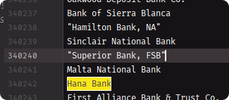
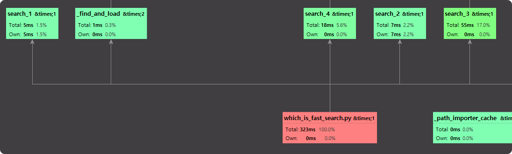
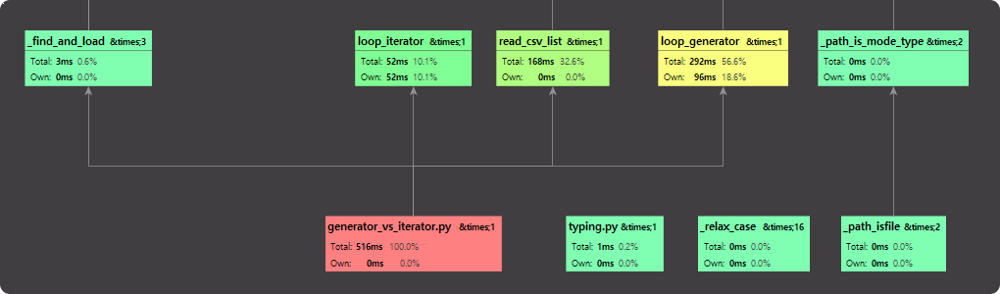

# Profile

## IDE Profile 
### 4가지 검색 방법 차이


약 40만 라인 csv 파일에서 "Hana Bank" 를 4가지 방법으로 검색
```python
def search_1(haystack, needle):
    for item in haystack:
        if item == needle:
            return True
    return False


def search_2(haystack, needle):
    is_exist = False
    for item in haystack:
        if item == needle:
            is_exist = True
    return is_exist


def search_3(haystack, needle):
    return any((item == needle for item in haystack))


def search_4(haystack, needle):
    return any([item == needle for item in haystack])


haystack = get_dataset('banklist.csv')
needle = 'Hana Bank'

search_1(haystack, needle)
search_2(haystack, needle)
search_3(haystack, needle)
search_4(haystack, needle)
```

### 검색 결과


* search_1 은 우선 `최적은 O(1), 최악은 O(N)`
* search_2 는 `무조건 O(N)`
* search_3 는 `True or False generator`
* search_3 는 `True or False iterator` 

Generator 는 메모리 측면에서는 매우 좋다.   
하지만 그걸로 어떤 manipulate 를 하는 순간 효율성이 떨어진다.

따라서, 단순 읽기는 `Generator` 로 하는 것이 일반적으로 좋고   
Manipulate 시에는 `Iterator`가 상속 구현 되어있는 list 가 일반적으로 좋다. 


## Generator, Iterator Comparison

### csv 파일 generator, iterator 로 읽어보기
```python
def read_csv_generator(filename: str) -> str:
    with open(filename, 'r') as file:
        for row in csv.reader(file):
            yield row[0]

def read_csv_list(filename: str) -> list:
    with open(filename, 'r') as file:
        bank_names = [row[0] for row in csv.reader(file)]
    return bank_names

generator = read_csv_generator("banklist.csv")
iterator = read_csv_list("banklist.csv")
print(sys.getsizeof(generator))
print(sys.getsizeof(iterator))
```
```python
112
3389552
```

### 여기서 Manipulate 해보면?
```python
def loop_generator(data: Generator):
    for n, d in enumerate(data):
        d += f"{n}"

def loop_iterator(data: Iterator):
    for n, d in enumerate(data):
        d += f"{n}"

loop_generator(generator)
loop_iterator(iterator)
```



* loop_iterator() + read_csv_list() = 220ms  
* loop_generator() + read_csv_generator() = 292ms

Generator 가 좋은 상황은 예를 들어서 directory 내 file names 를 읽어서  
file names 를 보여준다고 하거나 조작이 들어가지 않는 상황에서 좋다.

## cProfile

### DP 방식, Recursion 방식의 Fibonacci 함수 cProfile
```python
def fibonacci_dp(n):
    dp = [0, 1]
    for i in range(2, n + 1):
        dp.append(dp[i - 1] + dp[i - 2])
    return dp[n]

def fibonacci_recursion(n):
    if n <= 1:
        return n
    else:
        return fibonacci_recursion(n - 1) + fibonacci_recursion(n - 2)

num = 30
print(fibonacci_dp(num))
print(fibonacci_recursion(num))
```

* `ncalls`: 프로파일링 주기 동안 함수 호출 횟수
* `tottime`: 함수가 실행되는 동안 소비한 초 단위 시간, 다른 함수 호출 시간은 배제
* `tottime percall`: 함수를 호출하는 데 걸린 평균 시간. tottime / ncalls
* `cumtime`: 함수를 실행하는 데 걸린 초 단위 누적 시간, 다른 함수 호출 시간 포함
* `cumtime percall`: 함수를 호출할 때마다 걸린 시간에 대한 초 단위 평균 시간. cumtime / ncalls
```shell
python -m cProfile -s cumulative  High-Performance-Python\2-프로파일링으로-병목지점-찾기\2-1-cProfile.py

   2692572 function calls (36 primitive calls) in 0.526 seconds

   Ordered by: cumulative time

   ncalls  tottime  percall  cumtime  percall filename:lineno(function)
        1    0.000    0.000    0.526    0.526 {built-in method builtins.exec}
        1    0.000    0.000    0.526    0.526 2-1-cProfile.py:1(<module>)
2692537/1    0.525    0.000    0.525    0.525 2-1-cProfile.py:8(fibonacci_recursion)
        2    0.000    0.000    0.000    0.000 {built-in method builtins.print}
        1    0.000    0.000    0.000    0.000 2-1-cProfile.py:1(fibonacci_dp)
       29    0.000    0.000    0.000    0.000 {method 'append' of 'list' objects}
        1    0.000    0.000    0.000    0.000 {method 'disable' of '_lsprof.Profiler' objects}
```

## Time Profile

### 그냥 찍기
```python
start = datetime.datetime.now()
something_func()

print(datetime.datetime.now() - start)
```

### Decorator 사용
```python
def func_exec_time(func):
    def wrapper_fn(*args, **kwargs):
        start_time = datetime.datetime.now()
        result = func(*args, **kwargs)
        print("[{}] func_exec_time : {}".format(func.__name__, datetime.datetime.now() - start_time))
        return result
    return wrapper_fn

@func_exec_time
def something_func():
    print("Hello func")
```

### timeit 사용
#### Python
```python
t = timeit.timeit("""
def fibonacci_dp(n):
    dp = [0, 1]
    for i in range(2, n + 1):
        dp.append(dp[i - 1] + dp[i - 2])
    return dp[n]

fibonacci_dp(30)    
""")
print(t)
```
#### IPython
```python
%timeit fibonacci_dp(30)
2.74 µs ± 21.6 ns per loop (mean ± std. dev. of 7 runs, 100000 loops each)
```


## Memory Profile
```shell script
pip install memory_profiler
https://github.com/pythonprofilers/memory_profiler
```

### Memory profile 샘플
```python
from memory_profiler import profile

@profile
def something_method() -> Tuple[int, int]:
    a = [1] * (10 ** 5)
    b = [2] * (2 * 10 ** 6)
    c = [3] * (3 * 10 ** 7)
    del c
    return a, b

results = something_method()
```
```
Line #    Mem usage    Increment  Occurences   Line Contents
============================================================
     6     89.0 MiB     89.0 MiB           1   @profile
     7                                         def something_method() -> Tuple[int, int]:
     8     89.8 MiB      0.8 MiB           1       a = [1] * (10 ** 5)
     9    105.1 MiB     15.3 MiB           1       b = [2] * (2 * 10 ** 6)
    10    333.9 MiB    228.9 MiB           1       c = [3] * (3 * 10 ** 7)
    11    105.1 MiB   -228.9 MiB           1       del c
    12    105.1 MiB      0.0 MiB           1       return a, b
```


### 테스트 코드 2
```python
from memory_profiler import profile


@profile
def main():
    def read_csv_generator(filename: str) -> str:
        with open(filename, 'r') as file:
            for row in csv.reader(file):
                yield row[0]

    def read_csv_list(filename: str) -> list:
        with open(filename, 'r') as file:
            bank_names = [row[0] for row in csv.reader(file)]
        return bank_names

    generator = read_csv_generator("banklist.csv")
    iterator = read_csv_list("banklist.csv")


main()
```

```shell
Line #    Mem usage    Increment  Occurences   Line Contents
============================================================
     8     50.4 MiB     50.4 MiB           1   @profile
     9                                         def main():
    10     83.7 MiB      0.0 MiB           2       def read_csv_generator(filename: str) -> str:
    11                                                 with open(filename, 'r') as file:
    12                                                     for row in csv.reader(file):
    13                                                         yield row[0]
    14                                         
    15     50.4 MiB      0.0 MiB           2       def read_csv_list(filename: str) -> list:
    16     50.5 MiB      0.0 MiB           1           with open(filename, 'r') as file:
    17     83.7 MiB     13.9 MiB      394268               bank_names = [row[0] for row in csv.reader(file)]
    18     83.7 MiB      0.0 MiB           1           return bank_names
    19                                         
    20     50.4 MiB      0.0 MiB           1       generator = read_csv_generator("banklist.csv")
    21     83.7 MiB      0.0 MiB           1       iterator = read_csv_list("banklist.csv")
```

## Line profiler
```python
pip install line-profiler
```

### 테스트 코드
```python
import math

@profile
def calculate_something(size = 1000):
    temp = [0] * size
    for i in range(size):
        temp[i] = math.factorial(i)
    return temp


t = calculate_something()
```
```shell
kernprof.exe -l -v .\High-Performance-Python\2-프로파일링으로-병목지점-찾기\2-3-line_profiler.py

Wrote profile results to 2-3-line_profiler.py.lprof
Timer unit: 1e-06 s

Total time: 0.0127195 s
File: .\High-Performance-Python\2-프로파일링으로-병목지점-찾기\2-3-line_profiler.py
Function: calculate_something at line 4

Line #      Hits         Time  Per Hit   % Time  Line Contents
==============================================================
     4                                           @profile
     5                                           def calculate_something(size = 1000):
     6         1          3.0      3.0      0.0      temp = [0] * size
     7      1001        241.0      0.2      1.9      for i in range(size):
     8      1000      12473.5     12.5     98.1          temp[i] = math.factorial(i)
     9         1          2.0      2.0      0.0      return temp
```