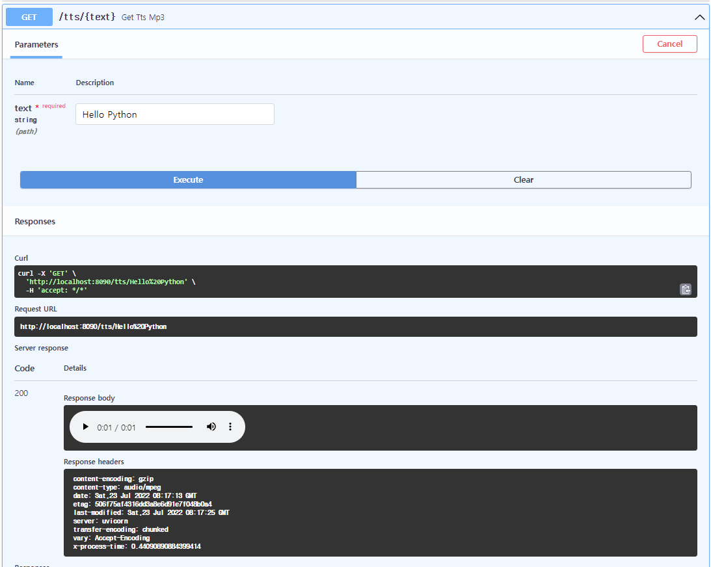

# TTS with FastAPI
FastAPI에서 TTS 구현

## app/api/tts.py
DB exist 체크로 생성되지 않았던 tts파일만 생성 하도록 되어있는데
**사용량이 많다고 한다면 Insert가 많아지니** 당연히 DB에 부담이 갈수 있다.
따라서, `Redis Set`로 저장하고 체크하는 것이 **더 효율적으로 보인다**. 또한 생성되었던 기록이 중요하다고 생각되어지지는 않는다.
```python
@router.get("/tts/{text}", response_class = FileResponse)
async def get_tts_mp3(text: str, db: Session = Depends(get_db)):
    if not tts_record_repo.is_exist_tts_record(db, text):
        tts_record_repo.create_tts_record(db, text)
        create_tts_file(text)

    return get_tts_save_path(text)
```

### FileResponse?
```
FileResponse 에서 제공
path - The filepath to the file to stream.
headers - Any custom headers to include, as a dictionary.
media_type - A string giving the media type. If unset, the filename or path will be used to infer a media type.
filename - If set, this will be included in the response Content-Disposition
```
```
Header에 추가
content-type: audio/mpeg
etag: 8605e7cb703e23450b8d6baea38b95c3
```

## tts_util.py
```python
def get_tts_save_path(text: str) -> str:
    return os.path.join(settings.media_dir, f"{text}.mp3")

def create_tts_file(text: str) -> bool:
    save_path = get_tts_save_path(text)
    tts = gTTS(text)
    tts.save(save_path)
    return True
```

## 결과


## TTS 생성의 메모리 사용량을 알아보자
```python
from memory_profiler import profile

@profile
def create_tts_file(text: str) -> bool:
    save_path = get_tts_save_path(text)
    tts = gTTS(text)
    tts.save(save_path)
    return True
```
tts.save() 메소드가 메모리를 생각보다 많이 먹는다
```python
Line #    Mem usage    Increment  Occurrences   Line Contents
=============================================================
    15     61.4 MiB     61.4 MiB           1   @profile
    16                                         def create_tts_file(text: str) -> bool:
    17     61.4 MiB      0.0 MiB           1       save_path = get_tts_save_path(text)
    18     61.4 MiB      0.0 MiB           1       tts = gTTS(text)
    19     65.2 MiB      3.8 MiB           1       tts.save(save_path)
    20     65.2 MiB      0.0 MiB           1       return True
```

## Redis 사용
### cache.py
```python
import redis
from app.core.config import get_config_settings

def get_redis():
    settings = get_config_settings()
    redis_instance = redis.Redis(
        host = settings.redis_host,
        port = settings.redis_port,
        charset = "utf-8",
        decode_responses = True
    )
    try:
        yield redis_instance
    finally:
        redis_instance.close()
```
### app/api/tts.py
```python
@router.get("/tts-redis/{text}", response_class = FileResponse)
async def get_tts_mp3_with_redis(text: str, redis: Redis = Depends(get_redis)):
    add_result = redis.sadd("tts", text)
    if add_result == 1:  # 0: set에 있음  /  1: set에 없음
        create_tts_file(text)
    return get_tts_save_path(text)
```

### redis-cli
`/tts-redis/{text}` 호출시 `Redis Set`으로 `sadd` 명령어를 통해 저장 될 것이다.
```python
127.0.0.1:6379> smembers tts
1) "Hello Hi World"
2) "123"
3) "world"
4) "hello"
```

## Redis와 DB 사용간의 성능 체크
네트워크 비동기I/O 작업이므로 Thread를 통해 
`100번  시도`에서 `number = i % 20`로 가정하고 호출 테스트
* `DB` 사용 : 0:00:11.719900
* `Redis` 사용 : 0:00:06.497167
* 거의 50% 정도의 수행시간 차이를 보임

```python
import threading
from datetime import datetime
import requests

class MyThread(threading.Thread):

    def __init__(self, number):
        super().__init__()
        self.number = number

    def run(self) -> None:
        # DB 사용 : 0:00:11.719900
        # resp = requests.get(f"http://localhost:8090/tts/{self.number}")  
        # Redis 사용 : 0:00:06.497167
        resp = requests.get(f"http://localhost:8090/tts-redis/{self.number}") 

start = datetime.now()
threads = []
for i in range(100):
    threads.append(MyThread(number = i % 20))
for th in threads:
    th.start()
for th in threads:
    th.join()
print(datetime.now() - start)
```