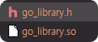

# Python With Go 

Python 은 쉽고, 깔금하고, 독립적이며, 짧은 시간안에 개발을 할 수 있으며,
수많은 라이브러리들을 사용 할 수 있다는 점에서 좋은 언어 이다.

다만, 파이썬의 장점의 모든 것들은 `속도` 라는 대가를 가진다.  
(numpy 같은 오픈소스 제외 하고는...)

pypy 나 pyc 등에 속도 향상을 대체도 있지만 실제 사용 해보면 현실은 녹록치 않다.

## Go to Python
Go 에서는 Go 를 C에 연결을 혹은 C를 Go에 연결을 도와주는 라이브러리를 제공한다.
https://golang.org/cmd/cgo/

Python 에서는 C 모듈을 가져와서 사용 할 수있는 기능이 있기 때문에
Go도 마찬가지로 사용이 가능하다.

<hr>

## Go .so 파일 만들기
import "C" 와   
사용 할 함수에 //export funcName 를 작성하면 된다.  

### Go 소스
```go
package main

import (
	"C"
	"fmt"
)

//export Ping
func Ping() {
	fmt.Println("Pong")
}

func main() {

}
```

### go build
```shell
go build -buildmode=c-shared -o go_library.so main.go
```

### go build 결과


* .h 는 Go 와 C 연동을 위해서 datatype 등 adapter    
* .so 파일은 컴파일된 공유 객체 라이브러리
```c
header

...
typedef signed char GoInt8;
typedef unsigned char GoUint8;
typedef short GoInt16;
typedef unsigned short GoUint16;
typedef int GoInt32;
typedef unsigned int GoUint32;
...

```


### Python 연동
```python
import ctypes

library = ctypes.cdll.LoadLibrary('./go_library.so')

ping = library.Ping
ping()
```
```shell
<CDLL 'C:\Script_Project\my_study\PythonWithGo\source\go_library.so', handle 7ffb7bbc0000 at 0x1ae18fcfc70>
Pong
```

## 몇가지 계산 샘플 테스트
```go
package main

import (
	"C"
	"fmt"
	"math/big"
)

//export Ping
func Ping() {
	fmt.Println("Pong")
}

//export Factorial
func Factorial(num int) {
	var fact big.Int
	fact.MulRange(1, int64(num))
	fmt.Println(fact.String())
}

//export TotalAdd
func TotalAdd(start, end int) int {
	var total int = 0
	for i := start; i <= end; i++ {
		total += i
	}
	return total
}

func main() {
}
```
```python
def factorial_go():
    import ctypes
    library = ctypes.cdll.LoadLibrary('./go_library.so')
    library.Factorial.argtypes = [ctypes.c_longlong]

    for i in range(10, 20):
        library.Factorial(i)

def factorial_python():
    import math
    for i in range(10, 20):
        print(math.factorial(i))
        
"""
factorial

%timeit -n 10 factorial_go()
84.1 µs ± 25 µs per loop (mean ± std. dev. of 7 runs, 10 loops each)

%timeit -n 10 factorial_python()
40.6 µs ± 12.2 µs per loop (mean ± std. dev. of 7 runs, 10 loops each)
"""
        
def total_add_go():
    import ctypes
    library = ctypes.cdll.LoadLibrary('./go_library.so')
    library.TotalAdd.argtypes = [ctypes.c_int, ctypes.c_int]

    library.TotalAdd(1, 10000)

def total_add_python():
    return sum([i for i in range(1, 10000)])

"""
total_add

%timeit -n 10 total_add_go()
82.5 µs ± 148 µs per loop (mean ± std. dev. of 7 runs, 10 loops each)

%timeit -n 10 total_add_python()
274 µs ± 16.3 µs per loop (mean ± std. dev. of 7 runs, 10 loops each)
"""
```

### 테스트 해보면서 느낀점
개노가다...  
Go에서 테스트 Python 에서 테스트 그리고 성능 테스트, 예외 테스트, 테스트테스트스트테   

이렇게 할바에 Go 파일 한개 작성해서 build 해서 command 로 실행 시키는게 더 효율적으로 보임  

### Python 이 Factorial 부분에서 왜 빠를까?
이 공식 참조
http://www.luschny.de/math/factorial/binarysplitfact.html

이진 분리
https://en.wikipedia.org/wiki/Binary_splitting

```shell
Divide-and-conquer factorial algorithm

Faster algorithms exist, but they're more complicated and depend on
a fast prime factorization algorithm.

factorial(n) is written in the form 2**k * m, with m odd.  
k and m are computed separately, and then combined using a left shift.

factorial(20) =
   (16) *
   (8) *
   (4 * 12 * 20) *
   (2 * 6 * 10 * 14 * 18) *
   (1 * 3 * 5 * 7 * 9 * 11 * 13 * 15 * 17 * 19)
```

```c++
static PyObject *
math_factorial(PyObject *module, PyObject *arg)
/*[clinic end generated code: output=6686f26fae00e9ca input=6d1c8105c0d91fb4]*/
{
    long x, two_valuation;
    int overflow;
    PyObject *result, *odd_part;

    x = PyLong_AsLongAndOverflow(arg, &overflow);
    if (x == -1 && PyErr_Occurred()) {
        return NULL;
    }
    else if (overflow == 1) {
        PyErr_Format(PyExc_OverflowError,
                     "factorial() argument should not exceed %ld",
                     LONG_MAX);
        return NULL;
    }
    else if (overflow == -1 || x < 0) {
        PyErr_SetString(PyExc_ValueError,
                        "factorial() not defined for negative values");
        return NULL;
    }

    /* use lookup table if x is small */
    if (x < (long)Py_ARRAY_LENGTH(SmallFactorials))
        return PyLong_FromUnsignedLong(SmallFactorials[x]);

    /* else express in the form odd_part * 2**two_valuation, and compute as
       odd_part << two_valuation. */
    odd_part = factorial_odd_part(x);
    if (odd_part == NULL)
        return NULL;
    two_valuation = x - count_set_bits(x);
    result = _PyLong_Lshift(odd_part, two_valuation);
    Py_DECREF(odd_part);
    return result;
}
```


### 참고
```
https://hamait.tistory.com/874
https://medium.com/analytics-vidhya/running-go-code-from-python-a65b3ae34a2d
```