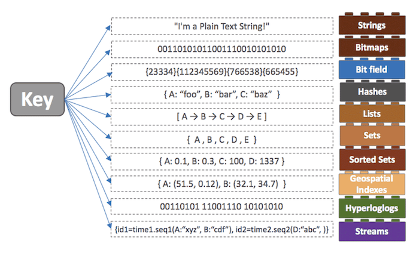
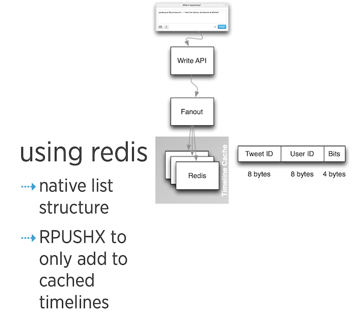
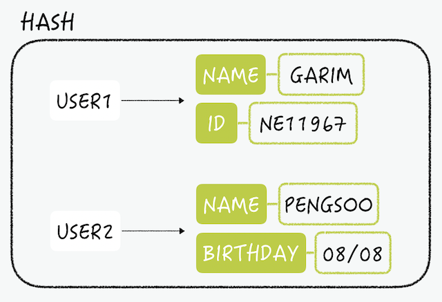

# Redis
Redis 설명 같은건 생략

## Redis 관리자
### Server OS
* Linux 환경이 Best
* kernel overcommit memory setting 추가
```shell
vi /etc/sysctl.conf

vm.overcommit_memory = 1
# 저장 다음 reboot
```
* Set kernel feature Transparent Huge Pages가 Redis memory 사용과 지연에 
영향을 미치지 않도록 추가
```shell
echo never > /sys/kernel/mm/transparent_hugepage/enabled
```

### Memory
* RAM과 swap memory가 동일하도록 설정.  
만약 설정이 되어 있지않다면 Redis가 너무 많은 메모리를 소모함에 따라 OOM 발생할 수도 있음.
* `maxmemory` option을 적절하게 설정.  
만약 10GM 램을 가지고 있다면, 8 or 9.
* 트러블 슈팅은 `Latency Doctor`와 `Memory Doctor` command를 사용.  
(https://redis.io/commands/latency-doctor/)  
(https://redis.io/commands/memory-doctor/)


### Replication
* backlog는 Replica가 Master와 효율적인 Sync를 가짐.
* If you use replication, Redis performs RDB saves even if persistence is disabled. (This does not apply to diskless replication.) If you don't have disk usage on the master, enable diskless replication.
  (TODO: 정확히 뭘 말하는 것인지 모르겠다 나중에 찾아볼 거나 알아보자)
* 만약 Master가 `persistence enabled` 되어 있는지 확인해라.
  * 그렇지 않다면 Master가 장애시 데이터는 다 날라간 상태일 것이고 Replica는 Master의 empty data를 가져갈 것이고 모든게 다 날라갈 것.


---
## DATA TYPES
* https://redis.io/docs/manual/data-types/


### KEY (모든것은 Key로)
* 너무 긴 Key는 메모리 측면에서 좋지 않다.
* 너무 짧거나 축약된 Key도 좋지 않다

### STRING
* 모든 종류의 문자열(Binary Safe) 저장 가능
* JPEG 이미지, HTML fragment, Serialized Object 등 캐시 용도로 사용
* 최대 사이즈 512MB


### LIST
* 일반적인 Linked List 특징을 가짐
* List내 수백만개 Item이 있더라도 head, tail 추가할 때 동일한 시간 소요
* 특정 값이나 인덱스로 데이터를 찾거나 삭제 가능
  (Linked List 이니 접근시에 O(N) 복잡도를 가짐)
* Pub-Sub(생산자-소비자) 패턴에서 사용  
  (생산자-소비자 패턴이란? https://coding-food-court.tistory.com/81)
* 트위터에서 각 유저별로 최근에 올린 트윗을 보여주는데 사용
* 홈페이지 최근 업데이트된 사진들을 빠른 속도로 보여주고 싶은 경우?
  * 매일 유저는 새로운 사진을 올릴것이고 이것을 `LPUSH`로 List에 Add
  * 그리고 우리는 유저가 홈페이지 방문하면 `LRANGE 0 9`로 최근 사진을 가져오자
* `LTRIM myList 0 999`명령어로 1000개의 최신 데이터를 유지할 수 있다.



### HASH

* 일반적인 해시 field-value를 가짐 

```shell
127.0.0.1:6379> hset user:1 name Snow
(integer) 1
127.0.0.1:6379> hset user:1 age 10
(integer) 1

127.0.0.1:6379> hmget user:1 name age
1) "Snow"
2) "10"
```
```shell
127.0.0.1:6379> hmset user:2 username Test age 11
OK
127.0.0.1:6379> hgetall user:2
1) "username"
2) "Test"
3) "age"
4) "11"
```

### SET
* 일반적인 Set로 중복 불가능
* 집합이니 교집합, 합집합, 차집합 연산을 Redis에서 연산 가능
* 프로젝트에 태그를 지정할 때 ID가 1000인 프로젝트에 1,2,7 태그 ID가 연결된 경우
```shell
sadd project:1000:tags 1 2 7
```
```shell
127.0.0.1:6379> sadd project:1000:tags 1 2 7
(integer) 3
127.0.0.1:6379> smembers project:1000:tags 
1) "1"
2) "2"
3) "7"
```


### SORTED SET
* Set와 마찬가지로 Key 하나에 중복되지 않는 여러 멤버를 저장하지만
  각각의 멤버는 스코어에 연결되고 모든 데이터는 이 값으로 정렬, 같다면 사전 순으로 정렬.
* 주로 정렬이 필요한 곳에서 사용.
* 가령 랭킹 같은


### Ref
* https://redis.io/docs/manual/admin/
* https://meetup.toast.com/posts/224
* https://meetup.toast.com/posts/225
* https://meetup.toast.com/posts/226
* https://meetup.toast.com/posts/227