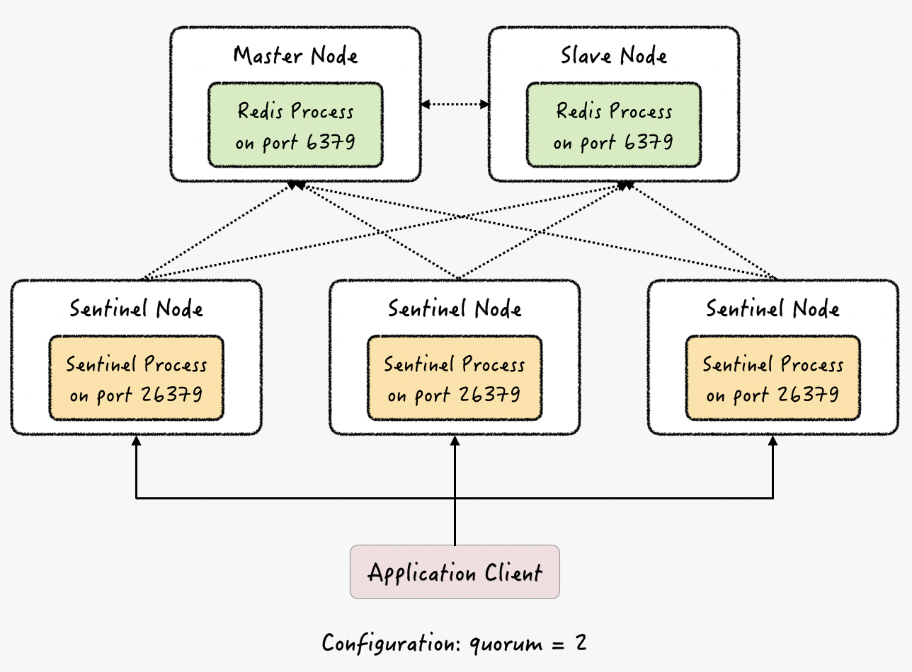
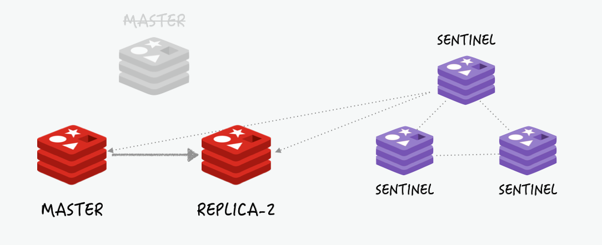

# Redis Architect
* https://redis.io/docs/manual/persistence/

## Redis Persistence
* Redis는 `In-memory`를 사용하기 때문에 어떠한 장애 발생시 데이터 유실 가능
* `Replication`이 되어 있다고 해도 개발 실수나 서버 명렁어 실수 등으로 데이터 유실 가능
* Redis를 `캐시 이외에 용도`로 사용 한다면 적절한 데이터 백업이 필요

### RDB (Redis Database)
* 설정 파일에 정의된 `Interval마다 Snapshot 저장`
* 자동 : `redis.conf`에서 `SAVE` option(시간 기준) 
* 수동 : `BGSAVE` 명령어로 `redis-cli`에서 수동으로 RDB 파일 저장
  * `SAVE` 명령어는 사용 X

#### 장점
* RDB는 very compact single-file point-in-time representation of your Redis data 
* 예를 들어 1시간 단위로 저장, 매일 저장 등 설정으로 특정 시점대로 복구할 수 있음
* AOF에 비해서 `Reids`의 빠른 재시작이 가능하다

#### 단점
* 특정 시간마다 작동하는 것으로 데이터 유실 가능성이 있다.
* 데이터 용량이 크다면 RDB 작성시간 동안 잠깐 Redis의 기능이 멈출수도 있다.


------
### AOF (Append Only File)
* Redis에 받은 `모든 Command를 로그로 작성`
* Redis가 시작할때 명령어들은 데이터 원복을 위해서 다시 재실행
* Command는 모두 Redis Protocol과 같은 형태로 저장
* 자동 : `reids.conf`에서 `auto-aof-rewrite-percentage` option(크기 기준)
* 수동 : `BGREWRITEAOF` 명령어로 `redis-cli`에서 수동으로 AOF 파일 재작성

#### 장점
* AOF는 Append-only log이므로 탐색이나, 오염등의 문제가 없음
  * 장애로 작성 중 끊긴 문장이 있어도 `redis-check-aof-tools`를 통해 해결
* 파일이 너무 커지면 자동으로 새 파일로 재작성 한다.
* AOF는 `Redis Command`를 포함하고 있어 이해하기 쉽고 Parsing, Export 작업에서 쉽다.
* 만약 `FLUSHALL` 명령어를 잘못하여 입력이 되어 실행 되었다면,
Redis를 멈추고 로그 파일에서 `FLUSHALL` 명령어 Line만 삭제하면 된다.

#### 단점
* RDB에 비해 파일 크기가 크다
* RDB에 비해 성능이 느릴수도 있다.


------
### No Persistence
* 데이터가 복구 유무 등 상관없다면, 상관 없음 


------
### RDB + AOF
* RDB와 AOF를 한 인스턴스에서 동시에 사용 가능
* 이 경우 Redis 재시작 시, AOF 파일을 이용해서 데이터 복구를 함


-------
## Redis Architect

### Replication

* `replicaof` 명령어로 간단하게 연결 구성
* 한개의 마스터만 존재 가능하며 `비동기식 복제`
* `HA(High Availity)` 기능이 없으므로 장애시 수동 복구

```shell
replicaof IP Port
```

#### Replication 작동 방식
1. `replicaof` 명령어를 마스터는 Child를 신규 `fork`하여
백그라운드 덤프 파일을 생성 및 replica로 전달
2. 전달 받은 덤프 파일을 로드


------
### Sentinel
일반적인 Master-Replication 구조에서는 `Master 장애시` Replica 접속하여 `replica no one` 명령어로 마스터 연결 해제 후
프로젝트에 설정된 Redis 연결정보를 모두 `Master → Replica`로 변경해야 하는데 
이를 하기위해서는 변경에 시간이 너무 많이 걸리고 그동안 서비스 장애가 발생하는데
이런 장애 상황을 피할 수 있도록 제공해주는 것이 `Sentinel` 이다.



* 자동 페일 오버 가능한 HA 구성
* Sentinel은 `Master와 Replica를 계속 모니터링`
* Sentinel 노드는 적어도 3대 이상의 홀수로 존재해야 함
  * 과반수 이상의 Sentinel 노드가 동의해야 페일오버 진행

#### Failover 작동 방식
1. Master와 2개의 Replica로 구성되어 서비스 중


2. Master 장애 발생, Sentinel들은 투표 진행


3. 과반수 이상의 동의로 페일오버 진행, Master 연결을 끊고
Replica 중 1개를 Master로 승격
 


------
### Cluster
* 데이터를 여러 Master에 자동으로 분산 저장
* 일부 Redis가 장애가 발생해도 계속 사용 가능


### Sharding
https://meetup.toast.com/posts/226