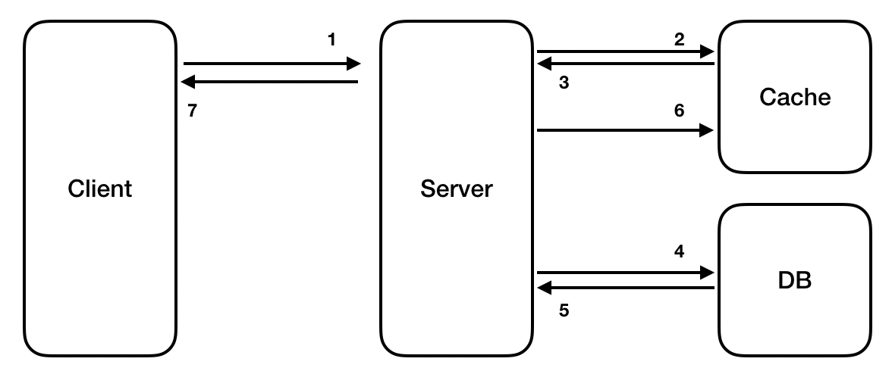
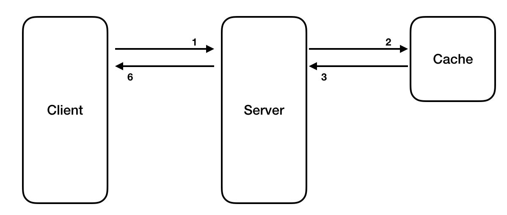
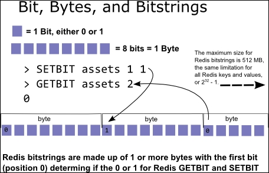

# Redis 사용

## Look Aside 

1. Redis Cache에 데이터가 있는지 확인
2. 데이터가 있다면(Cache Hit) 해당 데이터 Return
3. 데이터가 없다면(Cache Miss) DB에서 Fetch
   1. 해당 데이터 Redis Cache 저장
   2. 해당 데이터 Return

### 특징
* 실제 사용중인 데이터만 Cache
* Redis 장애가 치명적인 영향을 미치지 않음
* Cache Miss가 많은 경우 DB Query를 계속 실행하기 때문에 비효율적일수도 있음
* Update 등 최신 데이터가 동기화 되지 않음

---
## Write Through



### 특징
* DB 데이터 작성할 때마다 데이터를 Redis Cache에 추가, 업데이트
* Cache는 최신 데이터를 유지 가능하지만 DB와 Redis 두번의 과정을 거쳐 수행 시간이 증가
  (Insert, Update가 많은 시스템에서는 비효율적)
* Cache Miss시에 데이터를 동기화하기 어렵다
* 입력된 모든 Data를 Cache함으로 리소스 낭비


---
## 회원 좋아요 처리하기
게시물 댓글에 좋아요 기능에 대해 가정  
* 한 유저가 하나의 **댓글에 한번만** `좋아요`를 할 수 있도록 제한
  * RDB에서 `UNIQUE Constraint`로 처리를 할 수 있지만 많은 입력의 경우 성능 저하 발생
* Redis `Set` data type을 활용해서 기능 구현

```shell
sadd article:{article_id}:comment:{comment_id}:like {user_id}
```
```shell
127.0.0.1:6379> sadd article:1:comment:2:like 1
(integer) 1
127.0.0.1:6379> sadd article:1:comment:2:like 2
(integer) 1
127.0.0.1:6379> sadd article:1:comment:2:like 7
(integer) 1

127.0.0.1:6379> smembers article:1:comment:2:like
1) "1"
2) "2"
3) "7"
```

## 서비스 Unique Visitor 구하기
Unique Visitor를 구해야 하는 기능에 대해 가정
* 중복에 대해서 제거 필요
* Redis `Bit 연산`을 활용해서 저장 및 조회
* Bit를 하나의 유저로 생각하고 유저 접속시 bit를 1로 설정
  * 유저 1명 = 1 bit 
  * 유저 1,000명 = 1,000 bit
  * 유저 1,000,000명(백만명) = 0.125 Mega byte
  * 유저 100,000,000명(일억명) = 12.5 Mega byte


```shell
setbit key offset value
```
```shell
127.0.0.1:6379> setbit unique:visitor:20220722 1 1
(integer) 0
127.0.0.1:6379> setbit unique:visitor:20220722 10 1 
(integer) 0
127.0.0.1:6379> setbit unique:visitor:20220722 1000 1 
(integer) 0

127.0.0.1:6379> getbit unique:visitor:20220722 10
(integer) 1
127.0.0.1:6379> bitcount unique:visitor:20220722
(integer) 3
```