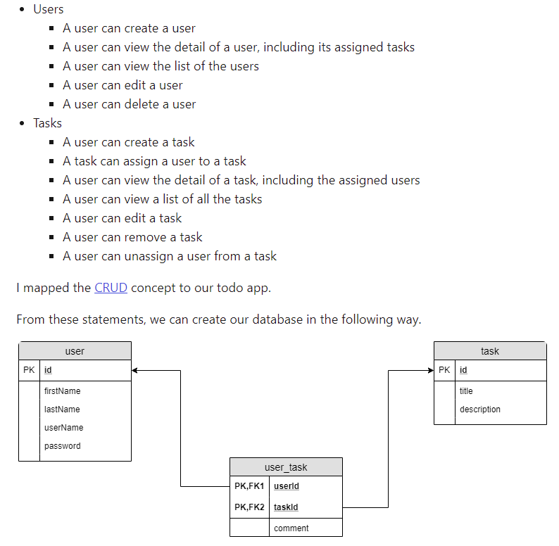
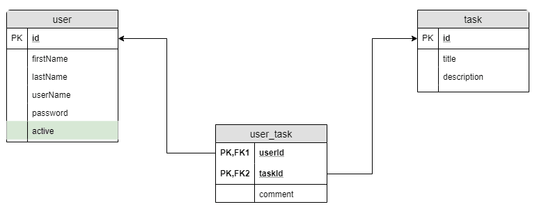
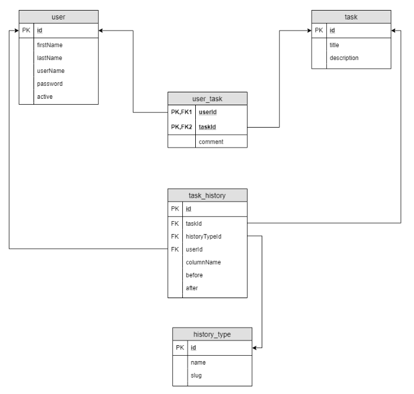
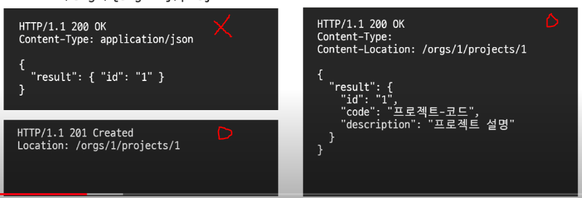
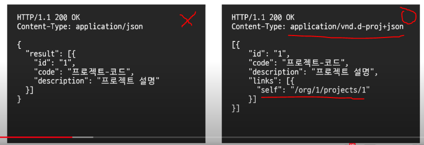
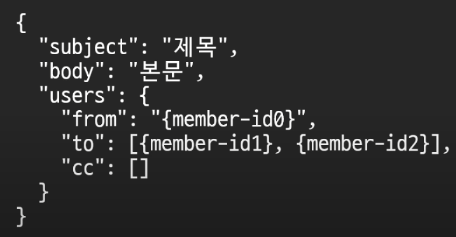
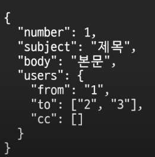

# RestAPI

## 간단한 REST API 설계 방법
### Start from a good database design
* Entity들이 반복 Connection이나 Circular Connection을 가지지 않도록
* Entity들의 연관 관계

### 1. Business needs and Database Schema
N:M 관계를 1:N, N:1 관계로 풀음

### 2. REST API Endpoints
#### Users
* POST `/api/users` Create a new user
* GET `/api/users/{id}/tasks` Get the list of all the task assigned to this user
* GET `/api/users` Get the list of all users
* GET `/api/users/{id}` Get the detail of a user
* PUT `/api/users/{id}` Update a user
* DELETE `/api/users/{id}` Delete a user

#### Tasks
* POST `/api/tasks` Create a new task
* POST `/api/tasks/{id}/users/{id}` Attach an existing user to the task
* GET `/api/tasks/{id}/users` Get the list of all the users assigned to this task
* GET `/api/tasks/{id}` Get the detail of the task
* GET `/api/tasks` Get the list of all tasks
* PUT `/api/tasks/{id}` Update a task
* DELETE `/api/tasks/{id}` Delete a task
* DELETE `/api/tasks/{id}/users/{id}` Dettach an existing user from the task

### 3. When Request to Delete a User
유저 같은 경우에 `DELETE` Method를 호출 한다고 하여도 Database에서 
삭제를 하지 않을 것이다. 이제 그렇게 되면 일반 유저와 삭제 유저를 구분하기 위해서
테이블을 수정을 해야 한다.

참고한 사이트에서는 `PUT` Method를 사용하라고 하는데,
비지니스 관점에서는 삭제로 보이기 때문에(비록 실제로 삭제는 안하지만)
`DELETE` Method를 사용하는게 맞아 보인다.

### 4. New Feature: Task History
Task의 등록, 수정 시간에 대해서 따로 기록을 해달라는 요청이 온다면
단순하게 Task 테이블에 `created_at`, `updated_at` 두 컬럼을 추가 해도 될 것이다.  

`created_at` 등의 `xx_at` naming convention 보다는
`date_of_created`, `datetime_of_created` 등의 convention을 가지는게 좋다.

다만 이렇게 한다면 미래에 다음과 같은 문제들이 발생할 수도 있다.
* 이전에 삭제한 Task의 등록 시간이 궁금하다면?
* Task를 4번 수정했는데 각각 언제 수정 했는지 궁금하다면?

#### 우리는 schema를 다음과 같이 변경할 수 있다.

이제 우리는 API End Point를 아래처럼 만들어 제공할 수 있다.
* GET `/api/tasks/{id}/histories` Get the list of changes

#### 참고
* https://dev.to/khalyomede/design-an-easy-to-use-and-flexible-rest-endpoints-3fia#4-should-you-store-timestamps-in-table

---
## NHN Dooray 예시
NNH Dooray API 팀은 다음과 같이 API 설계 및 구현을 했다.
이 설계 구조가 이후 새로운 기능 추가에서 어떤 문제가 있었는지에 대해서 설을 한다..
* https://www.youtube.com/watch?v=_SikP7FwZhY&list=PL-8zNJY17jaldLW6SP-hpbx7l3TnsmeeD&index=2&t=304s

#### 조직 Organizations
* POST   `/orgs`
* GET    `/orgs`
* GET    `/orgs/{org-id}`
* PUT    `/orgs/{org-id}`
* DELETE `/orgs/{org-id}`

#### 조직 Organizations - 조직원 Members
* POST   `/orgs/{org-id}/members`
* GET    `/orgs/{org-id}/members`
* GET    `/orgs/{org-id}/members/{member-id}`
* PUT    `/orgs/{org-id}/members/{member-id}`
* DELETE `/orgs/{org-id}/members/{member-id}`

#### 조직 Organizations - 프로젝트 Project
* POST   `/orgs/{org-id}/projects` 
Status Code 201을 주거나 200으로 준다면 생성 정보도 같이 Response

* GET    `/orgs/{org-id}/projects`  
Content-Type + Hateoas 추가해서 Response

#### 조직 Organizations - 프로젝트 Project - 업무 Tasks
* POST `/orgs/{org-id}/projects/{project-id}/tasks`

* GET  `/orgs/{org-id}/projects/{project-id}/task/{task-id}`
