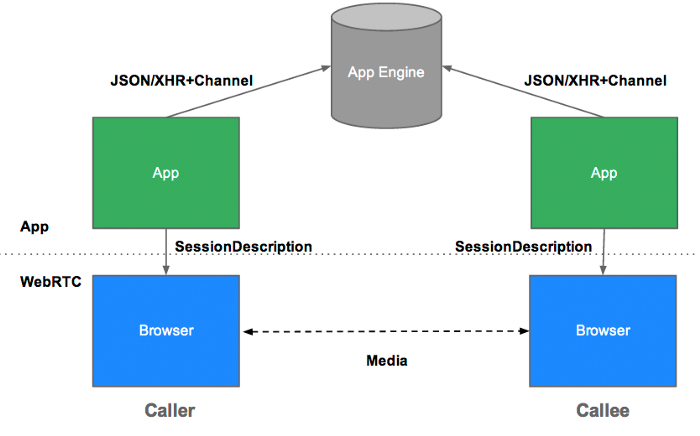

# Web RTC
Web RTC (Web Real-Time Communication)는 웹 브라우저 간에 플러그인의 도움 없이 서로 통신할 수 있도록 설계된 API이다.  
W3C에서 제시된 초안이며, 음성 통화, 영상 통화, P2P 파일 공유 등으로 활용될 수 있다.

## 통신 방법
Web RTC 는 P2P 통신에 최적화 되어 있으며 크게 3가지 클래스로 
실시간 데이터 교화이 이루어진다.
* MediaStream - 카메라/마이크 등 데이터 스트림 접근
* RTCPeerConnection - 암호화, 대역폭 관리 및 오디오, 비디오 연결
* RTCDataChannel - 일반적인 데이터 P2P 통신

위 3가지를 통해서 데이터 교환이 이루어 지며 RTCPeerConnection 이 
적절하게 데이터를 교환할 수 있도록 처리하는 과정을 **Signaling(시그널링)** 이라 한다.

## 용어
### Stun Server, Turn Server
P2P 기술이므로 Peer들 간의 네트워크 주소를 알아야 한다.  
서로간의 연결을 위한 정보를 공유하여 P2P 통신을 가능하게 해줌.
(https://alnova2.tistory.com/1110)

### SDP (Session Description Protocol)
SDP는 스트리밍 미디어의 초기화 인수를 기술하기 위한 포맷.(IETF의 RFC 4566)  
Web RTC는 SDP Format에 맞춰 영상, 음성 등 데이터 교환.

### ICE (Interactive Connectivity Establishment)
NAT 환경에서 자신의 Public IP를 파악하고 상대방에게 데이터 전송을 위한 Peer간의  
응답 프로토콜로 일반적으로 Stun/Turn 서버를 이용해서 구축.  
