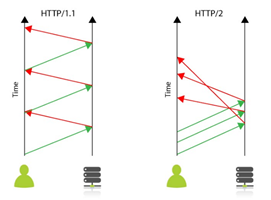
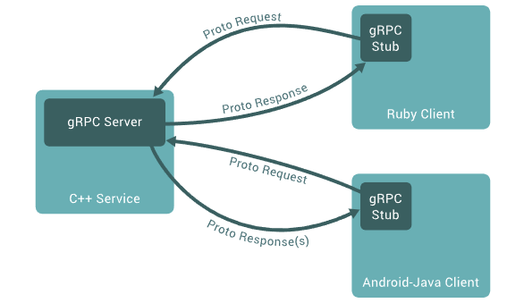
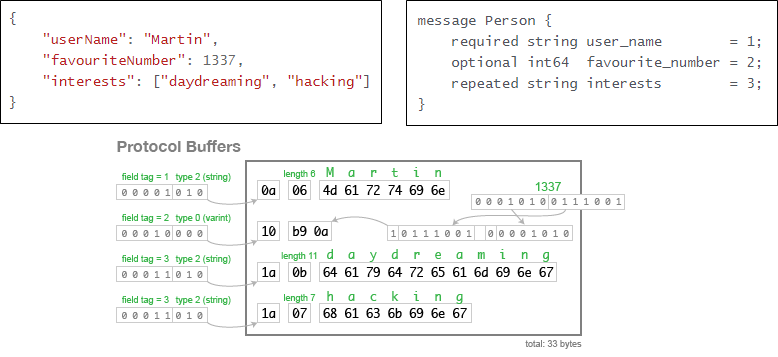

# gRPC (Remote Procedure Calls)
gRPC란, `Interface Definition Language(IDL)`과 기본 메시지 `Interchange Format`으로 
`Protocol Buffer`를 사용하는 기술.

Google에서 개발한 오픈소스 `RPC 프레임워크`이고 Protocol Buffer기반 Serializer에
`HTTP/2를 결합`하여 RPC 프레임워크를 구현.  

<details>
<summary>HTTP/2</summary>

HTTP/1.1은 Client 요청시에만 Server에서 응답을 하는 구조로 요청마다 Connection을 생성합니다.
cookie등 많은 정보를 가진 header가 중복 전달되어 비효율적인 부분이 있다.

그에 반해, HTTP/2는 한 개의 Connection에서 여러개 요청, 응답을 주고 받으며 header를 압축하여 
중복 없이 전달하기에 효율적인 부분이 있다.

#### Ref
* https://www.whatap.io/ko/blog/38/
</details>


## 개요
gRPC에서 Client App은 로컬 객체인 것 처럼 다른 머신의 Server APP의 Procedure(Function, Method)를 호출할 수 있고
이에 따라 분산 서비스를 쉽게 만들어준다. gRPC는 Parameter와 Return을 사용하여 원격으로 호출 가능한 Method를
지정하여 서비스를 정의합니다. 

Server Side에서는 gRPC 서버를 실행하여 Client Call을 처리하기 위한 Interface를 정의하고  
Client Side에서는 Server와 동일한 방법을 제공하는 `Stub`을 가지고 있어야 합니다.



gRPC는 다양한 환경에서 서로간의 운용이 가능합니다.  
예를 들면 `Java로 개발된 Server`와 `Go, Python 등으로 개발된 Client` 환경 처럼요.


## Protocol Buffer
Protocol Buffer는 Google에서 개발한 구조화된 데이터를 Serializer 하는 기법이다.
첫단계로 `proto file`로 Serialize할 데이터 구조체를 `.proto 확장자의 text file`을 정의해야 한다.
```shell
message Person {
  string name = 1;
  int32 id = 2;
  bool has_ponycopter = 3;
}
```
Protocol Buffer는 데이터는 `메시지로 구성`되며, 여기서 `각 kev,value는 Field` 이다.

데이터 구조체를 정의하면 Protocol Buffer Compiler `protoc`를 
사용해 선호하는 언어로 `Data Access Class`를 생성할 수 있다.

`Data Access Class`는 각 `Field`에 접근해주는 `name()`, `set_name()`
그리고 구조체를 `Raw bytes`로 `Serialze/Parse` 해주는 Method를 제공 한다.

#### Raw byte로 하는 이유
`Serialize는 구조체를 Byte 단위로 변환하는 작업`인데 아래 예제의 text기반의 
`json의 경우 82 byte`를 필요로 하는 것에 반해 `Protocol Buffer는 Field를 1 byte로 받아서 식별`하고
주어진 Length만큼 읽어서 `33 byte`를 필요로 한다.




### Ref
* https://grpc.io/docs/what-is-grpc/introduction/
* https://medium.com/naver-cloud-platform/nbp-%EA%B8%B0%EC%88%A0-%EA%B2%BD%ED%97%98-%EC%8B%9C%EB%8C%80%EC%9D%98-%ED%9D%90%EB%A6%84-grpc-%EA%B9%8A%EA%B2%8C-%ED%8C%8C%EA%B3%A0%EB%93%A4%EA%B8%B0-1-39e97cb3460
* https://chacha95.github.io/2020-06-15-gRPC1/